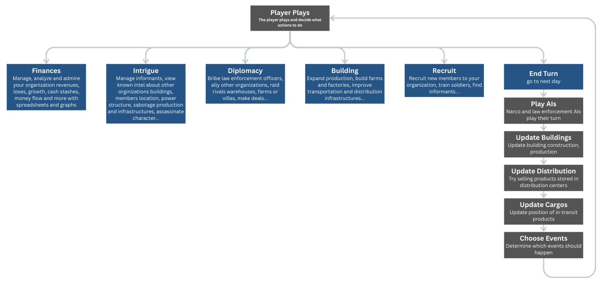
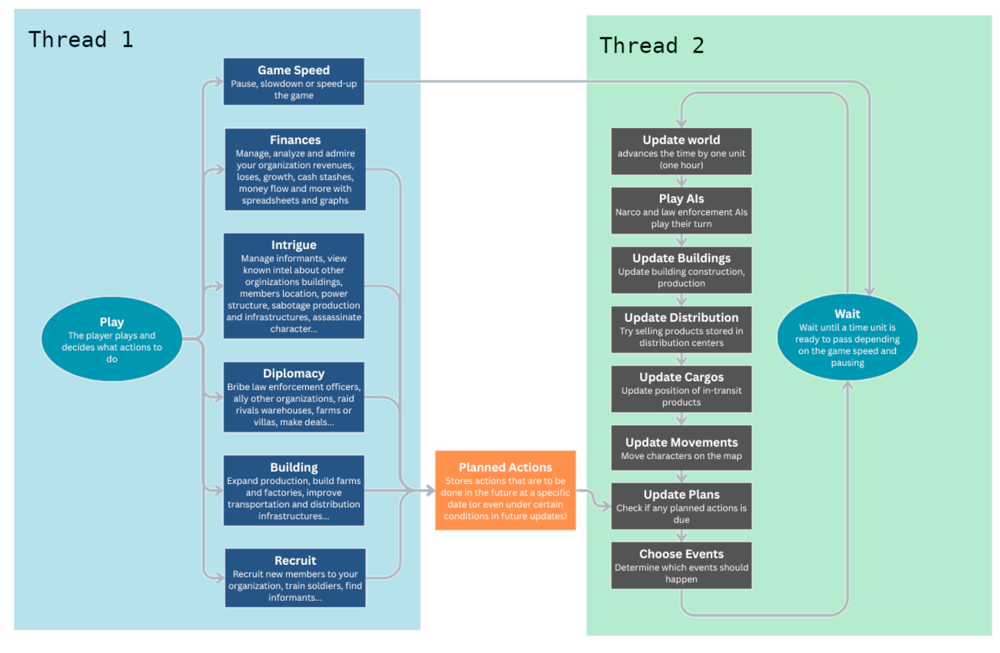
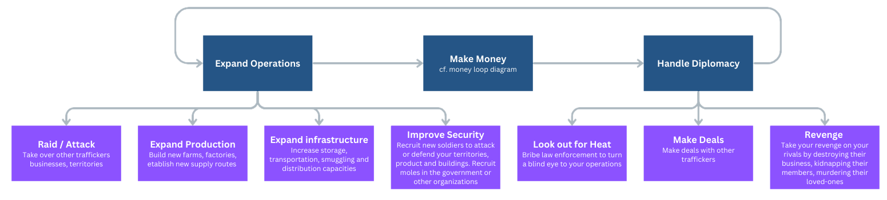
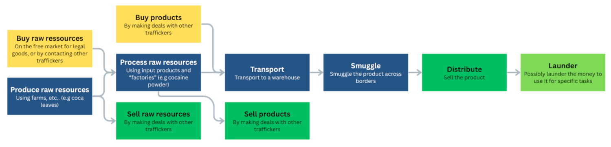

<!-- Header -->

    <h1>
        Underworld: Organized Crime   
        Dev Diary 1 - Planning  
        Written by <a href="https://github.com/Xorrad/">Xorrad</a> - August 23rd, 2025
    </h1>

    

        <!-- Table of Contents -->
        <h3>Table of Contents</h3>
        <a href="#section-intro">I. Introduction</a> 
        <a href="#section-dd">II. Dev Diaries</a> 
        <a href="#section-mvp">III. Minimum Viable Product</a> 
        <a href="#section-fe">IV. Future Expansions</a> 
        

        <!-- Content -->
        

            <h2>I. Introduction</h2>
            <i>Why making this game?</i> 
            After watching a lot of organized crime related movies and TV shows, I naturally wanted to create my own drug empire in a video game, producing and distributing drugs and weapons around the world, corrupting law enforcement officers, court judges and governmental officials and controlling countries from the shadows. However, I was quickly disappointed to discover that there are barely any games for the genre, especially management/strategy games. So instead of waiting for someone to make the game I wanted, I decided to take the lead and make it myself.
              
            <i>Why now?</i> 
            The idea of making a cartel/mafia management game has been in the back of mind for some time, but I have been continuously putting off the idea as I wasn't sure about how the game should look like or even be played. However, I finally decided to give it more thoughts after recently binge watching <i>The Godfather</i> and the <i>Narcos</i> TV shows <small>(great shows btw)</small>.
              
            <i>How will the game be made?</i> 
            The game will be initially an ASCII game programmed in C++. C++ might not be the best choice for making that kind of game, but I have a lot more experience in it that in Python, Rust, JavaScript or Go. I will be using my own terminal user-interface library <a href="https://github.com/Xorrad/tuim"><i>tuim</i></a> since I am naturally familiar with how it works and I can tune it to fit my needs. Similarly, it might be a bad idea, but I have tested several of the most famous libraries such as <a href="https://github.com/ggerganov/imtui"><i>ImTui</i></a> or <a href="https://github.com/ArthurSonzogni/FTXUI"><i>FTXUI</i></a> and neither fit what I was looking for in terms of features, customizability and ease of use.
              
            <i>Why an ASCII game?</i> 
            There are several reasons, but the primary one is that I suck at making UIs. I have been trying to produce a full-fletched game for a decade, but each time, I got discouraged with how gruelling and time-consuming making UIs is. So, similarly to <a href="https://www.bay12games.com/dwarves/"><i>Dwarf Fortress</i></a>, I choose ASCII in order to focus more on developing actual gameplay mechanics. That being said, I still think that UX is important to enjoy properly a video game and I will making sure that menus are smoothly navigable with the arrow keys and keybinds that make sense.
              
            <i>Will the game be moddable?</i> 
            Modding will not be a main focus for the minimum viable product nor the following expansions, but I will definitely keep modding support in mind when implementing features. I believe modding is essential for this kind of games and really help with building a dedicated commmunity and growing the scope of the game beyond anything I could achieve on my own. Furthermore, since the game will be open-sourced on GitHub, anyone is welcomed to discuss features, or even implement them if they have any programming experience.
        

        

            <h2>II. Dev Diaries</h2>
            I've never written any dev diary before, but I feel it’s a great way not only to share progress on the game, but also to reflect on future features and carefully consider how they should work, how they might impact gameplay, and how they ought to be implemented in code.
              
            Although nobody is probably reading this yet, it might help grow a small community and provide live feedback on features, fixes, improvements, and anything I may have overlooked.
              
            Following those principles, future dev diaries will focus on explaining and illustrating gameplay features in detail, both to enlighten possible readers and to clarify my own design choices. They will serve as a record of progress, a place to explore ideas, and a way to refine the game’s direction through reflection and, hopefully, community feedback.
        

        

            <h2>III. Minimum Viable Product</h2>
            <b>Goal</b>: a single-player, ASCII management sim where you run a criminal organization, manage resources, expand territory, fight rivals and evade or corrupt law enforcement.
              
            To avoid repeating my past mistakes and getting lost in overly complex mechanics, risking never releasing a playable version, I plan to focus on building a Minimum Viable Product (MVP) that will serve as version 1.0. From there, I’ll rethink and improve specific aspects of the game one at a time, gradually making it more polished, more complex, and more enjoyable to play.
              
            So first, we need to define a core gameplay loop that is both fun and compelling. I drew inspiration from some of my favorite games and highlighted the elements that make them engaging to play (in my opinion):
             
             
            <ul>
                <li><a href="https://store.steampowered.com/app/529340/Victoria_3/"><i>Victoria 3</i></a>: <ul>
                    <li>Watching your economy grow and numbers exponentially rise.</li>
                    <li>Expanding influence by taking ownership of foreign industries.</li>
                </ul></li>
                <li><a href="https://store.steampowered.com/app/1158310/Crusader_Kings_III/"><i>Crusader Kings 3</i></a>: <ul>
                    <li>Overthrowing dynasties and placing your own family on their thrones.</li>
                    <li>Eliminating enemies through assassination and intrigue.</li>
                    <li>Playing as a vulnerable character rather than an abstract entity, with the constant threat of death and succession crises.</li>
                    <li>Dynamic character relationships that make roleplaying feel natural and immersive.</li>
                </ul></li>
                <li><a href="https://store.steampowered.com/app/311260/The_Guild_3/"><i>The Guild 3</i></a>: <ul>
                    <li>Starting weak and vulnerable, then rising to power by corrupting officials or seizing control of the city council.</li>
                    <li>Recruiting and arming soldiers to ambush and eliminate rivals.</li>
                    <li>Monopolizing production by sabotaging or destroying competitors' businesses.</li>
                </ul></li>
                <li><a href="https://store.steampowered.com/app/289070/Sid_Meiers_Civilization_VI/"><i>Civilization VI</i></a>: <ul>
                    <li>The "one more turn" effect of gradually expanding territory and building an empire.</li>
                </ul></li>
                <li><a href="https://store.steampowered.com/app/394360/Hearts_of_Iron_IV/"><i>Hearts of Iron IV</i></a>: <ul>
                    <li>Managing logistics and stockpiles for your armies.</li>
                </ul></li>
            </ul>
             
            Of course, implementing all of these ideas would be too ambitious for version 1.0. For example, managing stockpiles of weapons could instead be part of a future expansion focused on enhancing the military side of the game: introducing paramilitaries, government armies, raids, turf wars, and more. Similarly, in-depth family management like in <i>Crusader Kings</i> could be introduced in a dedicated update alongside: friendships and feuds, loyalty, marriages, alliances, etc...
              
            So, to summarize, here’s what I expect the initial version to include:
              
            <ul>
                <li>The "one more turn" effect: a building nearly complete, an assassination about to be executed, fresh intel just discovered...</li>
                <li>Watching numbers rise and feeling more and more powerful: <i>line goes brrr</i></li>
                <li>Struggles for territory, influence, money or revenge.</li>
                <li>Hiding law enforcement and evading justice through corruption.</li>
            </ul>
             
            Keeping all that in mind, here’s a rough sketch of how I picture the game loop at first:
            
            <small style="color: #666666; text-align: center;display:block;">1. turn-based game loop</small>
            <small style="color: #666666">Note: For now, the actions available to the player remain fairly broad, but I’ll dive into their details in future dev diaries as the game’s development progresses.</small>
              
            However, questions about how turns should work come up quickly. A fully turn-based approach presents challenges, especially regarding time scale. If a turn represents a single day, progress would feel way too slow, with lots of turns where little to nothing happens. If it represents a week, it wouldn’t make sense in situations where events or actions unfold rapidly.
              
            Since the game is primarily about managing an empire in a strategic manner, with no "on-ground" tactical view or direct combat, I believe a real-time loop with a relatively small minimum time unit, such as an hour, would be the most fitting approach. This would allow players to passively reap the rewards of their efforts once operations are established, while still giving them the flexibility to expand whenever they choose.
              
            This leads us to the following sketch of a real-time-based game loop:
            
            <small style="color: #666666; text-align: center;display:block;">2. real-time-based game loop</small> 
            With one thread dedicated to the UI and player actions, while the other handles the game world: constructing buildings, moving characters, triggering events, and other background tasks.
              
            Finally, here’s a rough idea of what the overall gameplay loop should look like:
            
            <small style="color: #666666; text-align: center;display:block;">3. gameplay loop</small> 
            And here’s how the money-making process fits into that loop:
            
            <small style="color: #666666; text-align: center;display:block;">4. making money loop</small> 
        

        

            <h2>IV. Future Expansions</h2>
            Once the minimum viable product is complete and the core gameplay is stable, future expansions could introduce entirely new layers of complexity and replayability. For example, a military-focused expansion could add stockpiles of weapons, paramilitary factions, in-depth government armies and revamp raids and turf wars. Another expansion might delve into politics and diplomacy, allowing players to influence governments, rig elections, manipulate laws, or sway public opinion to their advantage. Economic expansions could bring more complex systems of trade, black markets, and monopolies or increase production chains complexity. Narrative-focused updates could introduce storylines and more diverse events.
              
            That kind of dreaming will have to wait for another time, and hopefully my motivation lasts long enough to bring all those ideas to life.
        

    

